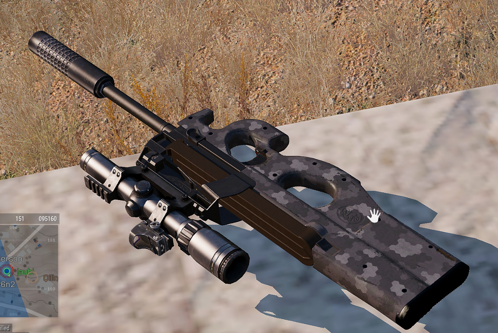
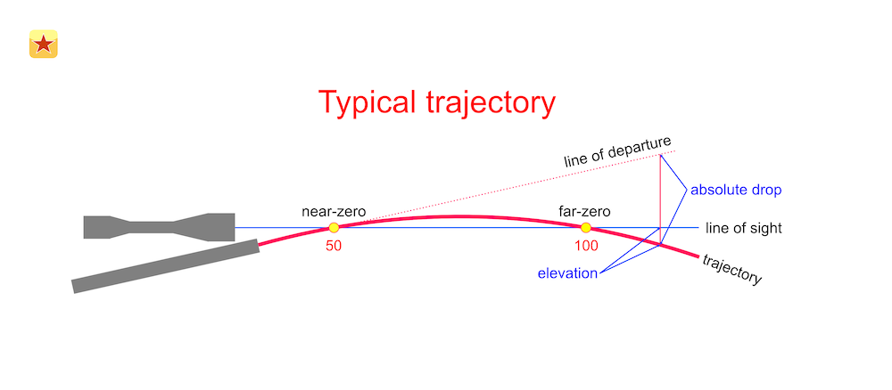
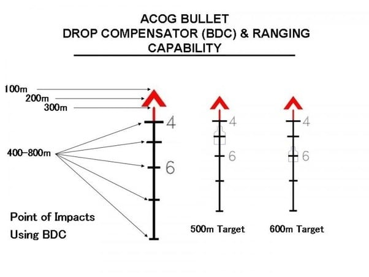
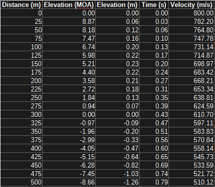
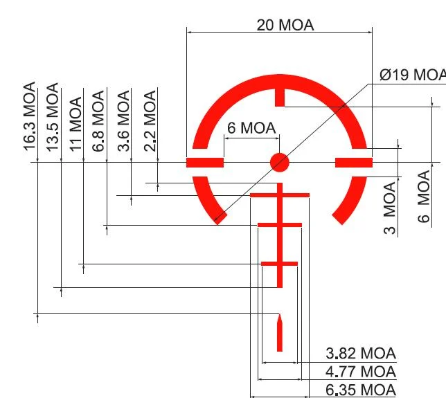
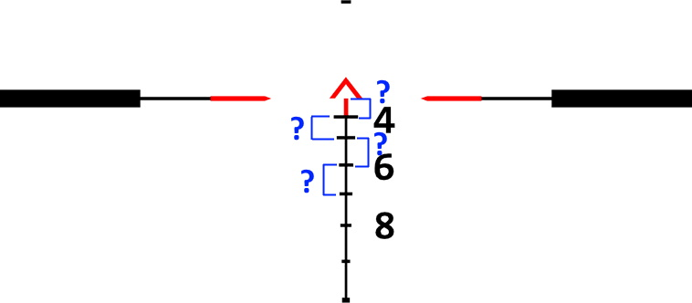

## Background
[ARMA 3](https://arma3.com/) is probably my most-played game of all time based on Steam playtime (I'll let you guess how many hours I have - I'd rather not say). The game is a military simulator and has a somewhat high-fidelity ballistics simulation.
One of the mechanics I find interesting (and a massive upgrade from ARMA 2) is the ability to add optics and other attachments to your weapons. The modularity of this system lets you mix and match sights arbitrarily across different weapons, which can 
lead to some *interesting* combinations. 

<figure>
  
  <figcaption>An example of what the game's weapon customization lets you create. Just because you can, doesn't mean that you should.</figcaption>
</figure>

The game has some general-purpose optics with a fixed zero distance (it's the same regardless of what weapon you mount it on). Instead of adjusting your zero to engage targets at different ranges, you use the optic's built-in Bullet Drop Compensator (BDC). 
You might not know what that means, but that's okay, I'll explain below. But, to the original point, I wanted to write a tool which could simulate ARMA 3's ballistics model so I could compute the zero of each BDC index for any of these fixed-zero optics on 
any weapon in the game. 

### A Primer On Terminal Ballistics 
Say you want to throw a ball far, like really far. What do you intuitively do? You throw the ball *upwards* at an angle to maximize the distance it covers before falling back to the ground. To zero a rifle, you do the same thing on a much larger scale - 
"zeroing" is essentially the act of finding out how much of an upward angle you need to launch your bullet at in order to hit to your line of sight at a given distance. 

Your sights are always mounted directly above your barrel, so the barrel has to be angled upward relative to your line of sight in order for the bullet to intersect it at some point(s). At the time of firing, the bullet starts below the line of sight and intersects it 
on its way up (near zero), reaches its apex, and falls downward and eventually intersects the line of sight again (far zero). The far zero is typically the most relevant distance, and the one that you actually zero for. The vertical distance between your optic/line of 
sight and the barrel's axis is known as *height over bore*. Interestingly, ARMA 3 simulates height over bore, but to the best of my knowledge, its zeroing calculations don't account for it. Taller height over bore will give you the impression of a steeper/more pronounced 
bullet trajectory since the barrel has to be angled upward more drastcially in order to achieve a zero. 

<figure>
  
  <figcaption>The barrel axis is angled upwards relative to your line of sight. The two intersections between the bullet's trajectory and your line of sight are called the "near" and "far" zeroes.</figcaption>
</figure>

ARMA 3 has two approaches to zeroing, depending on what kind of optic you use. Some of the optics in-game allow for adjustable zero distance, typically in increments of 100 meters. These zero distances are calculated dynamically based on the specific weapon that the
optic is mounted to, so a 100 meter zero (or 200m, 300m, etc.) is always correct, regardless of the weapon it's mounted to. The second type of in-game optics utilize a fixed zero distance, typically a 100, 200, or 300 meter far zero. At distances closer than this zero,
your bullet will impact above your point of aim. At distances farther than this zero, your bullet will impact below your point of aim. Some optics have reticles which compensate for drop at farther distances by providing hash marks (holdovers) that you can use to aim
with. These types of reticles are called Bullet Drop Compensators (BDCs), and they assume a specific projectile weight and velocity. 

<figure>
  
  <figcaption>An example of a BDC reticle. In this example, a 100m zero at the tip of the chevron gives the listed holdovers. These holdovers assume a specific projectile velocity, and deviating from that assumption will change the actual zero distance of each holdover.</figcaption>
</figure>

The problem with BDCs, and why I decided to write my calculator, is that the actual holdover distance for each BDC mark deviates from what is indicated on the reticle if you use BDC optics on weapons that they weren't intended for. The holdover marks are still useful, 
but you need to calculate what distance the holdovers *actually* correspond to in order to use them well on a given weapon. ARMA 3 has several BDC optics and I haven't been able to find official documentation on which optic is intended for which rifle. You'll probably 
see a lot of statements on the internet like "the RCO is meant for the MX, the ARCO is meant for the Katiba, and the MRCO is meant for the Mk20", but in my experience, the BDCs for these "intended" pairings don't always line up super well, and there are examples in 
some of the official in-game loadouts that contradict this, like the AAF Marksman who uses a Mk14 EBR paired with an MRCO. 

Most of the engagement distances in ARMA 3 are close enough that  it doesn't really matter that much and you can more or less just shoot to your point of aim, but knowing your holdovers can help you land some insanely far shots. 


### The Calculator
#### Overview
I wrote the calculator in C# and used WPF for the frontend, since I wanted to learn something more modern than WinForms. I used [ScottPlot](https://scottplot.net/quickstart/wpf/) for displaying the chart and [Math.NET Numerics](https://numerics.mathdotnet.com/) for vector
math in the simulation calculations. 

<figure>
  
  <figcaption>The calculator showing simulation results for the <a href="https://armedassault.fandom.com/wiki/MX_series">MX Rifle</a> with a 300m zero.</figcaption>
</figure>

The calculator takes the following input parameters:
- **Zero distance:** Your intended zero distance, in meters. 
- **Muzzle Velocity:** The muzzle velocity of your weapon, in meters/second. I had to determine this in-game with some helper code (see the SQF below).
- **Air Friction:** A unitless coefficient which ARMA 3 uses to simulate bullet drag. I also had to determine this in-game with helper code.
- **Time Step:** How precise the simulation calculations are, in seconds. Smaller time steps give more precise results but may take longer to calculate.
- **Chart Step Size:** The interval between sampled points on the resulting projectile path plot and the output CSV file, in meters. 
- **Chart Max Range:** How far to run the simulation, in meters.

The calculator displays a plot of the projectile's flight path - the Y axis shows the projectile's relative height and the X axis shows the projectile's distance, both in meters. In addition to the plot, the calculator computes the following result fields:
- **Zero angle:** The projectile's departure angle at the muzzle (distance 0m) relative to your line of sight, given in Minutes Of Angle (MOA). There are 60 MOA in one degree.
- **Terminal Velocity:** The projectile's velocity at the maximum simulated distance, in meters/second. 
- **Time of Flight:** How much time the projectile took to reach the distance set in "Chart Max Range", in seconds.

The results can be optionally output to a .CSV file:

<figure>
  
  <figcaption>The corresponding CSV for the above example.</figcaption>
</figure>

#### Compiling and Running
- Create a WPF Project in Visual Studio.
- Clone the [repository](https://github.com/JOBBIN9422/A3BallisticsCalculator).
- Build the project and run. Fill out the input fields using the given SQF script as needed. 

#### Helper Script
This SQF script extracts the muzzle velocity and air friction from the player's weapon. Place it in the ARMA debug console and execute it. You can manually copy these values into the calculator. 
```
player enableStamina false; 
player setCustomAimCoef 0; 
player setUnitRecoilCoefficient 0; 
player addEventHandler ["Fired", { 
params ["_unit", "_weapon", "_muzzle", "_mode", "_ammo", "_magazine", "_projectile", "_gunner"]; 
 
_airFriction = getNumber (configFile >> "CfgAmmo" >> _ammo >> "airFriction"); 
_velocity = velocity _projectile; 
_velocityAbs = vectorMagnitude _velocity;
_horizontal = [_velocity select 0, _velocity select 1, 0]; 
_angleBtwn = (acos (_velocity vectorCos _horizontal)) * 60; 
//hint str _angleBtwn; 

hint format [ 
    "Projectile: %1\nAirFriction: %2\nVelocity: %3", 
    _ammo, 
    _airFriction, 
    _velocityAbs 
];
  
}]; 
```

#### Zero Calculations
Bullets in ARMA 3 are only subject to gravity and constant drag from air resistance (airFriction, the unitless coefficient from above). I used the vanilla zeroing calculations from the [ACE3 Mod](https://github.com/acemod/ACE3) as a basis for my calculator. 
The zero calculation algorithm does the following:
- Assume an 8 second maximum time of flight. While the simulated projectile has been in flight for less than 8 seconds, do the following:
    - Compute the projectile's current velocity and position (simulate vertical acceleration due to gravity and horizontal drag due to constant air friction).
    - Advance the projectile's flight time by the given time step.	
- Compute the zero angle by taking the arctangent of the projectile's Y position over its zero distance, which is also the total distance traveled. 

The above algorithm simulates in constant time steps, but the output plot and .CSV are incremented in units of distance, instead. To achieve this, 
[Cubic Spline Interpolation](https://en.wikipedia.org/wiki/Spline_interpolation) was used on the time-stepped simulation in order to reinterpolate the points of the shot's trajectory for increments
of distance.

#### Shortcomings
Previously, I mentioned wanting to write this calculator so I could calculate the holdovers of the various BDC reticles for any in-game weapon. The problem is that, to do that, you need subtensions (accurate angular measurements of the BDC reticle). For real-world
sights, the manufacturer usually supplies that info so you can compute your own holdovers for any cartridge load, but ARMA 3 is a video game and the developers don't provide that kind of info. I tried to compute these from the in-game texture files, by measuring against
in-game objects, and by scaling the in-game reticles to real-world equivalents (like the ACOG), but ultimately didn't get far. Unfortunately, that means that I can't really use the calculator for its original intended purpose, but it's still a good tool and I learned
a lot while making it. 

<figure>
  
  <figcaption>A reticle with subtensions provided by an optics manufacturer, each measurement is given in Minutes Of Angle (MOA).</figcaption>
</figure>


<figure>
  
  <figcaption>The actual in-game texture file for one of the BDC sights. The problem - I don't know the actual measurements/subtensions of the reticle, so I can't compute any holdovers for it.</figcaption>
</figure>

### Conclusion 
I didn't get to solve the problem that I set out to solve by writing this calculator, but I still learned a lot. Hopefully you found this interesting!

## References
- [ACE3 Mod](https://github.com/acemod/ACE3)
- [ARMA Wiki](https://armedassault.fandom.com/wiki/ArmA_3)
- [BI Community Wiki](https://community.bistudio.com/wiki/Main_Page)
- [Strelok](https://www.strelokpro.online/StrelokPro/typical_errors.html)
- [GitHub Repo](https://github.com/JOBBIN9422/A3BallisticsCalculator)