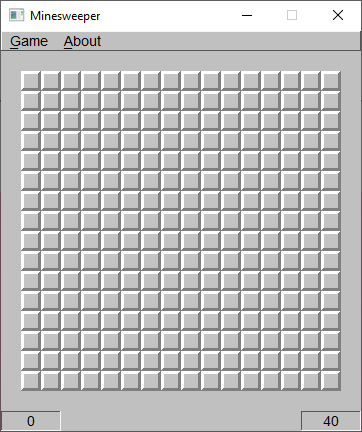
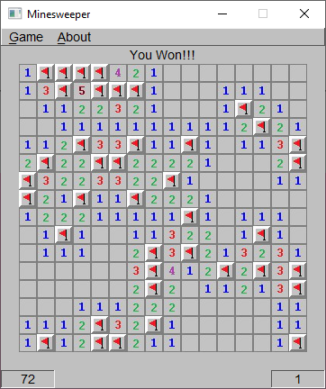
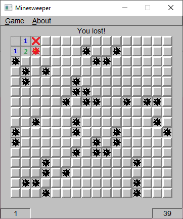
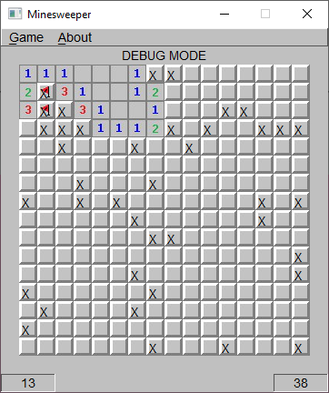

## Summary
My Intro to Computer Science final project was to implement the classic Windows game, "Minesweeper", in C++. There isn't much else to say here - it's Minesweeper!

## Images
<figure>
  
  <figcaption>The starting grid.</figcaption>
</figure>

<figure>
  
  <figcaption>A cleared game.</figcaption>
</figure>

<figure>
  
  <figcaption>kaboom.wav</figcaption>
</figure>

<figure>
  
  <figcaption>This was the "debug" mode - all mines are marked with Xs to help with testing the game logic. You can obviously also just use it to cheat.</figcaption>
</figure>