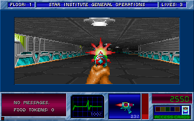
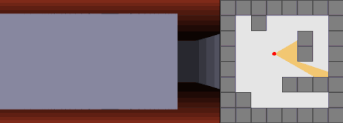

## Background
I've always enjoyed retro FPS games, especially ones of the pseudo-3D variety, there's just something about the visuals that I find really appealing. When I was a kid, I found out about [DOSBox](https://www.dosbox.com/) and used it to play games like 
[Heretic](https://en.wikipedia.org/wiki/Heretic_(video_game)) and [Strife](https://en.wikipedia.org/wiki/Strife_(1996_video_game)) before school in the mornings. Once I graduated from college, I wanted to try and implement my own basic retro FPS engine 
as a fun project and to learn more about computer graphics. 

<figure>
  
  <figcaption>Blake Stone (1993), a good example of a game using raycasted visuals.</figcaption>
</figure>

## How Does Raycasting Work?
Raycasting is a clever algorithm which can render a pseudo-3D perspective from 2D map data. The general idea is that a "ray" is cast for every vertical column of pixels in the display window in a conical pattern from the camera's position in the direction it's facing.
Each ray will eventually intersect with a wall in the game space, and the distance that the ray traveled is used to scale the size of the wall when it's drawn to the screen.

<figure>
  
  <figcaption>How raycasting constructs a 3D scene from 2D map data.</figcaption>
</figure>

## Attempt 1: C++ Engine
My first attempt was implemented in C++ using SDL2 for rendering and input. It's very barebones - it only supports orthgonal (textured) walls and static world entities. I made some questionable design decisions and stopped the project before getting too far.

<figure>
  
  <figcaption>The end-result - flat-color floors and ceilings with textured walls.</figcaption>
</figure>

### SDL2
I decided to use SDL2 for the rendering side of this project since I was reasonably familiar with it. In hindsight, I wish I would have learned to use a proper graphics library, but it works well since the engine is so basic - floors and ceilings are just solid-color
rectangles, and wall textures and world entities are rendered as 1 pixel-wide SDL_Texture strips.

### World Map
The limitations of the raycasting technique require the game world to be grid-based, so I implemented the world map as a 2D array of "Tile" objects. Each tile simply had a wall texture and an enum specifying its type (wall, floor, etc). I originally intended to create 
a level editor to go along with the game engine (or at least allow the engine to read map data from a text file), but I never got that far and ended up hard-coding a test map within the game engine instead. The test map consists of a textured perimiter wall with a central
textured pillar wall. I lifted all of the wall textures from [Wolfenstein 3D](https://en.wikipedia.org/wiki/Wolfenstein_3D).

### Player Movement
The player object has hard-coded movement and turning speeds which dictate how much they can move/turn per game tick. On each tick, the player's keyboard input is read and their heading and/or XY position is updated by applying their move/turn speed. Move speed is scaled by
the engine's current framerate.

### Collision Detection
Any time the player attempts to move, the game engine checks where they would have ended up on the next game tick. If this target position contains a wall, the move attempt is blocked. This keeps the player from clipping into/through walls. 

### The Camera
In 3D rendering engines, the camera usually consists of a vector which indicates the camera's heading along with a plane which is normal to the camera vector and sits at a certain distance in front of it. This setup allows for perspective projection.
In a pseudo-3D rendering image, the camera plane can be replaced with a vector which is perpendicular to the camera's heading vector. This makes the raycasting math straightforward because each ray can be cast along the length of the plane vector. 
I decided to omit the camera plane vector in my implementation and instead try to infer it from the screen width, which proved to be a pretty bad idea and made a lot of the rendering math pretty frustrating and convoluted. 

<figure>
  
  <figcaption>a pseudo-3D camera. I didn't use this technique (oops).</figcaption>
</figure>

### Rendering
The raycasting engine does the following on each game tick to draw the scene:
1. Draw the floor and ceiling as solid-color rectangles.
2. For each column of the display window, do the following:
    1. Calculate the direction of the current ray to be cast based on the player's heading and current display column.
	2. Cast the ray by stepping along the world map grid in the direction of the ray's heading until we hit a wall tile. 
	3. Calculate the distance that the ray traveled.
	4. Calculate the height of the wall strip to be drawn using the distance calculated in the previous step. 
	5. Find the slice at which the ray intersected the wall that it hit. Use this to calculate which vertical strip of the wall's texture needs to be drawn.
	6. Draw the texture slice with the height calculated in step 4 at the current display column.
	
The above algorithm loops over every vertical column in the display window and each loop pass will draw a column of wall texture to the screen (scaled by distance to the player). This will construct a perspective-correct pseudo-3D scene with texture-mapped walls!

### Compiling & Running
- Install libraries:
  - [SDL2](https://www.libsdl.org/download-2.0.php)
  - [SDL2_image](https://www.libsdl.org/projects/SDL_image/)
  - [Armadillo](http://arma.sourceforge.net/)
- Use the included makefile (Linux) or build the source files in an empty C++ project within Visual Studio ([Windows](https://lazyfoo.net/tutorials/SDL/01_hello_SDL/windows/msvsnet2010u/index.php)).

### Controls
- **WASD:** Move/strafe
- **Left/right arrows:** Turning

## Attempt 2: Java Engine
About a year after I wrote the first engine, I got a job with Cisco Systems as a Java developer. I didn't have much exposure to Java besides a few college courses, and I had some ideas on how to improve my first raycasting engine attempt, so I decided to reimplement
it in Java. 

<figure>
    <video muted controls>
    <source src="videos/java-raycaster.mp4" type="video/mp4">
  </video> 
  <figcaption>a pseudo-3D camera. I didn't use this technique (oops).</figcaption>
</figure>

## References
- [Lode Vandevenne](https://lodev.org/cgtutor/raycasting.html)
- [Permadi](https://permadi.com/1996/05/ray-casting-tutorial-table-of-contents/)
- [Hunter Loftis](https://www.playfuljs.com/a-first-person-engine-in-265-lines/)