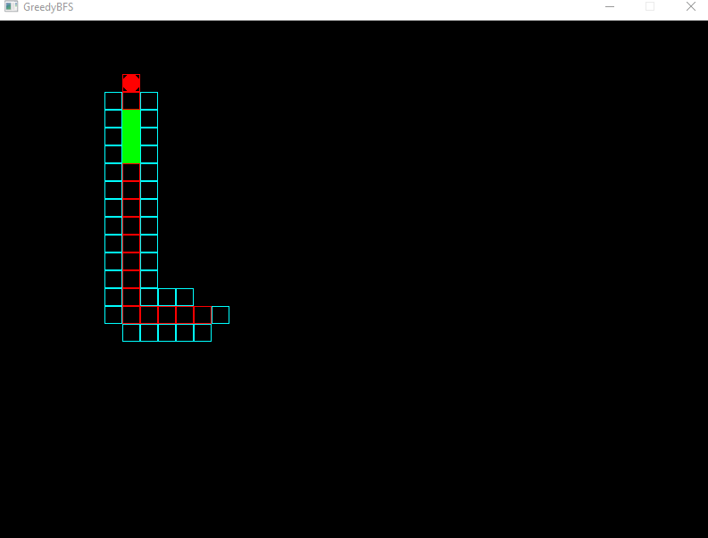
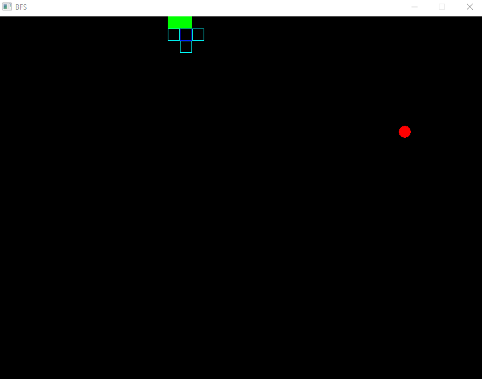
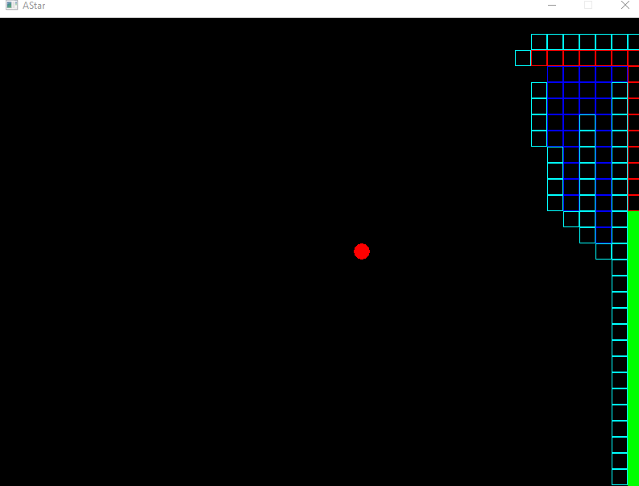
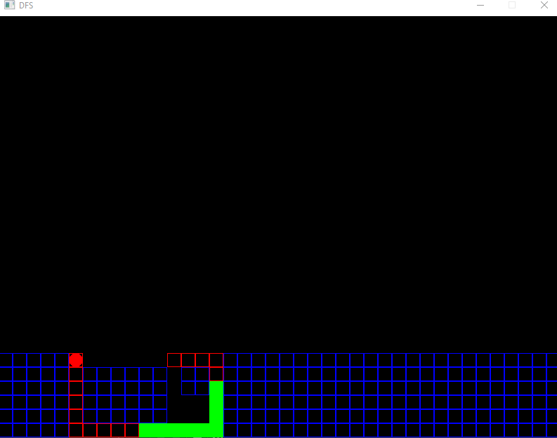
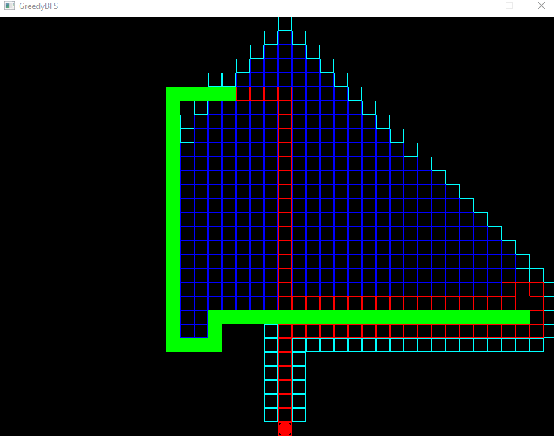
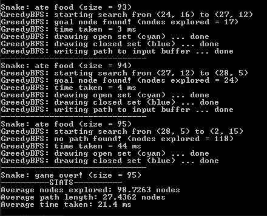
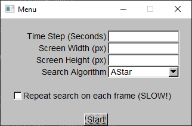

<figure>
  
  <figcaption>Greedy BFS finding a path from the snake's head to the food each time it eats.</figcaption>
</figure>

## Background
Back when I wrote this project, I was taking my Introduction to AI class in college. We covered a lot of pathfinding algorithms (BFS, DFS, etc.) and I wanted to code something to enhance my understanding of them.
I had written *Snake* in C++ recently, so I decided to automate it with a pathfinding AI. 
		 
## Summary
The game plays itself using one of several shortest-path algorithms. The following algorithms are included:
- A-Star
- Greedy Best-First Search
- Breadth-First Search
- Depth-First Search

In addition to choosing which algorithm to use, you can set the screen size, time step, and whether or not to repeat the pathfinding on each frame. Once you start the game, it plays until the snake eventually crashes
into itself (there is no end).

### The Game Loop
On each frame, the AI performs the following steps to find a path between the snake's head and the food:
1. Get the positions of the snake's head and the food. 
2. If a path hasn't been found yet or we want to repeat the pathfinding on each frame, perform the search using the selected algorithm to find a path between the snake's head and the food. 
3. The pathfinding algorithm builds a path between the given start and goal positions with the snake's body treated as an obstacle. This path is traversed backwards to create a sequence of move commands ("LEFT", "RIGHT", "UP", "DOWN") which is given to the snake.
4. The snake reads a direction from the sequence of movement commands given by the algorithm and moves in that direction.

### Legend
Each algorithm's search is drawn on the game field:
<ul>
  <li><strong>Blue: </strong>Nodes which have already been explored (closed set).</li>
  <li><strong>Cyan: </strong>Nodes which are currently being explored (frontier/open set).</li>
  <li><strong>Red: </strong>The path selected by the algorithm.</li>
</ul>

### Algorithms

<figure>
  
  <figcaption><strong>Breadth-first search</strong> evaluates all of a given node's
			  neighbors before proceeding outwards. This algorithm will explore a lot more paths/nodes on average than A-Star since it doesn't have a heuristic to prioritize potential paths with.</figcaption>
</figure>

<figure>
  
  <figcaption>The <strong>A-Star algorithm</strong> operates similarly to BFS but with the addition of a heuristic function which it uses to evaluate potential paths and prioritize them based on their goal distance and distance from the starting point.</figcaption>
</figure>

<figure>
  
  <figcaption><strong>Greedy best-first search</strong> is essentially A-Star search but with a different heuristic function which only prioritizes nodes by their distance to the goal node. This can achieve similar results while exploring fewer nodes.</figcaption>
</figure>

<figure>
  
  <figcaption><strong>Depth-first search</strong> explores all nodes in a given direction from the current node before choosing another path. For this reason, it explores a lot of unnecessary nodes before finding the goal.</figcaption>
</figure>

### Continuous Search
The paths selected by each algorithm ultimately become more and more convoluted as the snake grows. Since the snake's body is a moving obstacle, the initial path selected by each algorithm can be improved as the snake's body moves out of the way.

If the "Repeat search on each frame" option is selected, the game will re-run the path search on each game step. This is a lot slower but definitely improves the pathfinding - the snake tends to survive for longer when this option is enabled. 

<figure>
  
  <figcaption>Repeated searching allows Greedy BFS to 'tighten' its original path around the snake's tail segments.</figcaption>
</figure>

### Statistics
The program tracks various statistics about each run in order to allow for easy comparison of the different algorithms. This gives a better idea about the time and space complexity of each search and allows you to weigh the pros and cons of different shortest-path algorithms.

<figure>
  
  <figcaption>Statistics collected at the end of each run.</figcaption>
</figure>

## Compiling & Running
If you're using a Linux-based OS, check out the [repository](https://github.com/JOBBIN9422/SnakeAI) and use the included makefile. 
For Windows, follow [these directions](https://bumpyroadtocode.com/2017/08/05/how-to-install-and-use-fltk-1-3-4-in-visual-studio-2017-complete-guide/) with the source code from the repository.

The game settings:
- **Time Step (Seconds):** The length of each frame in seconds (default 0.05).
- **Screen Width (px):** The window width in pixels (default 800). Note: the game plays on a grid of 20x20 pixel squares. 
- **Screen Height (px):** The window height in pixels (default 600).
- **Search Algorithm:** The pathfinding algorithm used to guide the snake (default A-Star).
- **Repeat Search on Each Frame:** Toggles whether or not to re-evaluate the snake's path on each frame.

## Remarks
I wrote this at a time when FLTK was the only graphical software I knew how to develop in. Definitely a great choice for writing a game it's a GUI toolkit (the snake segments are styled UI boxes).
Something like SDL2 would have been a more reasonable pick.

## References
- [Wikipedia](https://en.wikipedia.org/wiki/A*_search_algorithm)
- [Red Blob Games](https://www.redblobgames.com/pathfinding/a-star/introduction.html)
- [Fast Light Toolkit](https://www.fltk.org/)