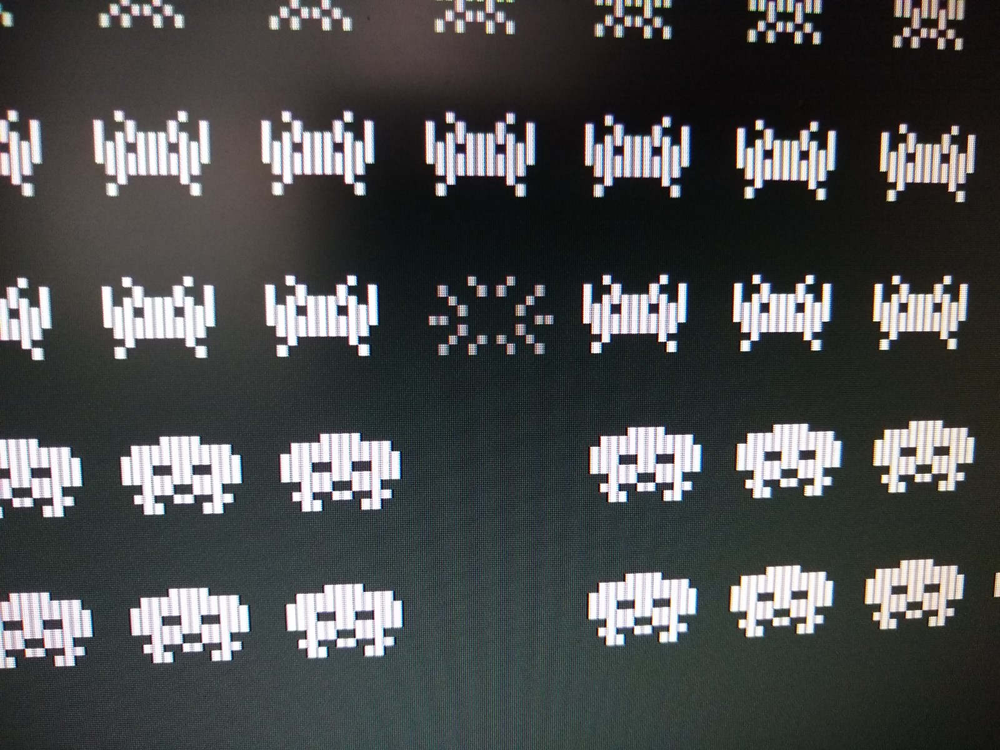

## Summary

For this project, I decided to emulate the classic arcade game, *Space Invaders*. Player 1 controls and all sounds are implemented. Although *Space Invaders* doesn't use all of the Intel 8080 CPU instructions, I decided to implement them for completeness.

## Compiling & Running
- Download the source code from the [repository](https://github.com/JOBBIN9422/8080Invaders').
- Build using the included makefile.
- Run the executable.

## Controls
- **Shift:** insert coin
- **Enter:** P1 start
- **Left/Right arrow keys**: P1 move left/right
- **Spacebar:** P1 fire

## Remarks
Interestingly, *Space Invaders* draws all of its graphics horizontally (player and shields at left edge, score display at right edge). In order to present the player with an upright view, the CRT monitor was simply rotated 90 degrees counter-clockwise when mounted in the cabinet. 
Vertical scanlines in the CRT monitor make this fact apparent. While the original method sounds trivial (physically rotate the display so the graphics are oriented correctly), digitally rotating the display buffer in real-time ended up becoming one of the more challenging parts of this project.

<figure>
  
  <figcaption>Vertical scanlines of the game display (CRT scanlines are horizontal when not rotated).</figcaption>
</figure>

Initially, I copied the game's framebuffer to a new array on each frame, then rotated that copy to display coordinates and read it out to the screen. Obviously, this was not efficient - it destroyed my CPU and memory usage. 
After some tinkering, I came up with the below algorithm which maps each framebuffer pixel to its rotated display pixel in one pass:

## References
- [Computer Archeology](https://computerarcheology.com/Arcade/SpaceInvaders/')
- [Emulator 101](http://www.emulator101.com/')
- [8080 Opcodes](http://pastraiser.com/cpu/i8080/i8080_opcodes.html')