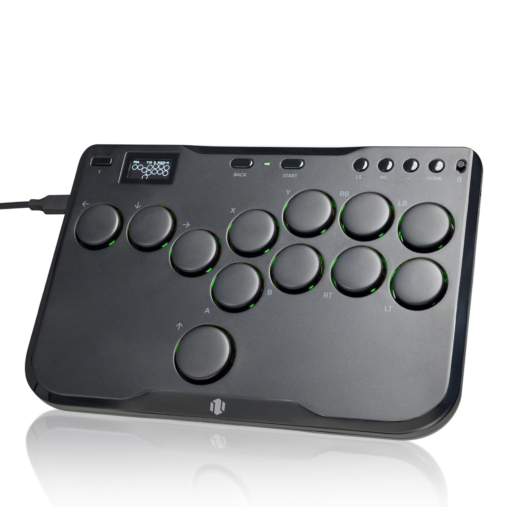

## Background
I've had an interest in emulation for a long time, mostly so I can play games from tons of different systems on my PC. Back in like 2008, I put [WinKawaks](https://www.winkawaks.org/) on the family computer and used it to play Neo-Geo games, and it was all downhill from there.
Once I started going to school for computer science & engineering, I wanted to try and write some of my own emulators on the side as a learning exercise. I started with [CHIP8]() and then chose *Space Invaders* as my next project since it was a 
popular beginner-level emulation project. 

The 1978 arcade game *Space Invaders* doesn't really need an introduction but you might not know much about its hardware - it runs on an Intel 8080 CPU clocked at 2 MHz, has black-and-white graphics (color is provided by tinted overlays on the monitor),
and all sound comes from custom analog circuitry (RLC circuits). Those features make it really appealing as a beginner emulation project - the CPU is relatively straightforward, there isn't any color to handle, and the analog sound hardware can be mimicked with recordings of the original game sounds. 

<figure>
  
  <figcaption>Color overlays used to provide the green tint along the player area at the bottom of the screen.</figcaption>
</figure>

## Summary

I wrote the emulator in C++ using SDL2 for rendering, audio, and reading player input. Player 1 controls and all sounds are implemented. Although *Space Invaders* doesn't use all of the Intel 8080 CPU instructions, I decided to implement them for completeness.

## Compiling & Running
- Download the source code from the [repository](https://github.com/JOBBIN9422/8080Invaders).
- Build using the included makefile.
- Run the executable.

## Controls
- **Shift:** insert coin
- **Enter:** P1 start
- **Left/Right arrow keys**: P1 move left/right
- **Spacebar:** P1 fire

## Remarks

### The Control Panel
The control panel on the original arcade machine oddly uses buttons for left/right movement instead of a joystick which was pretty much the standard. If you're into fighting games, then you're probably familiar with the huge proliferation of all-button ("leverless") controllers 
in the past few years. Some players prefer these since 8-way digital inputs can be input really efficiently and they can be pretty ergonomic with one finger per movement button, but I'm team fightstick for life. I guess *Space Invaders* was 40 or so years ahead of the curve on 
the all-button controller front.

<figure>
  
  <figcaption>The original, all-button control panel.</figcaption>
</figure>

<figure>
  
  <figcaption>A typical, modern leverless controller. These things hurt my hands.</figcaption>
</figure>

### Display Rotation
Interestingly, *Space Invaders* draws all of its graphics horizontally (player and shields at left edge, score display at right edge). To give the player and upright view, the CRT monitor was mounted in the cabinet in portrait orientation (rotated counterclockwise). 
You can tell that this is the case by taking a close look at the scanlines of the arcade machine's monitor (they're vertical). Digitally rotating the display buffer in real-time was surprisingly one of the more challenging parts of this project. If I was using a proper
graphics library, I could have probably done this with a simple transformation, but I didn't know any better at the time and was just writing pixels to a framebuffer.

<figure>
  
  <figcaption>Vertical scanlines of the game display (CRT scanlines are typically horizontal and scan left-to-right and top-to-bottom).</figcaption>
</figure>

Initially, I copied the game's framebuffer to a new array on each frame, then rotated that copy to display coordinates and read it out to the screen. Obviously, this wasn't efficient and tanked performance. 
After some tinkering, I came up with the below algorithm which maps each framebuffer pixel to its rotated display pixel in one pass:



void Game::copyToPixelBuffer()
{
    //get a reference to the game's RAM
    array<unsigned char, 0x10000> memory = cpu.getMemory();
    int buffIndex = 0;
    int bitShift = 0x1;

    //loop over the framebuffer region of the RAM
    for (int i = 0x2400; i < 0x2420; i++)
    {
	//for each pixel of the current byte of RAM
        for (int p = 0; p < 8; p++)
        {
            for (int j = 0; j < SCREEN_HEIGHT; j++)
            {
		//rotate the framebuffer pixels to display coordinates
                int addr = 32 * j + i;
                unsigned char currByte = memory[addr];

		//determine if the current pixel of the current byte is 1 or 0
                if ((currByte & bitShift) == bitShift)
                {
		    //set the buffer appropriately and increment its index
                    pixelBuffer[buffIndex++] = 0xffffffff;
                }
                else
                {
                    pixelBuffer[buffIndex++] = 0x0;
                }
            }
	    //set the bit mask to check the next bit in the current byte
            bitShift <<= 1;
        }
	//reset the bit mask
        bitShift = 0x1;
    }
}



## References
- [Computer Archeology](https://computerarcheology.com/Arcade/SpaceInvaders/)
- [Emulator 101](http://www.emulator101.com/)
- [8080 Opcodes](http://pastraiser.com/cpu/i8080/i8080_opcodes.html)