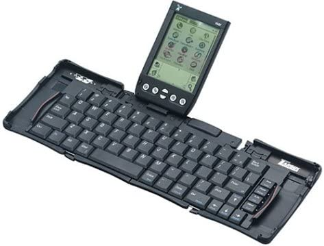
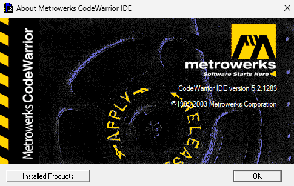
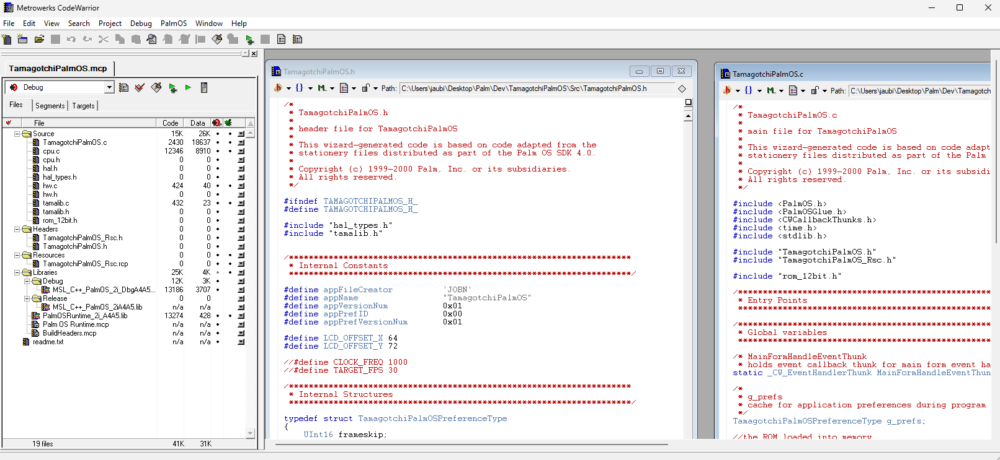
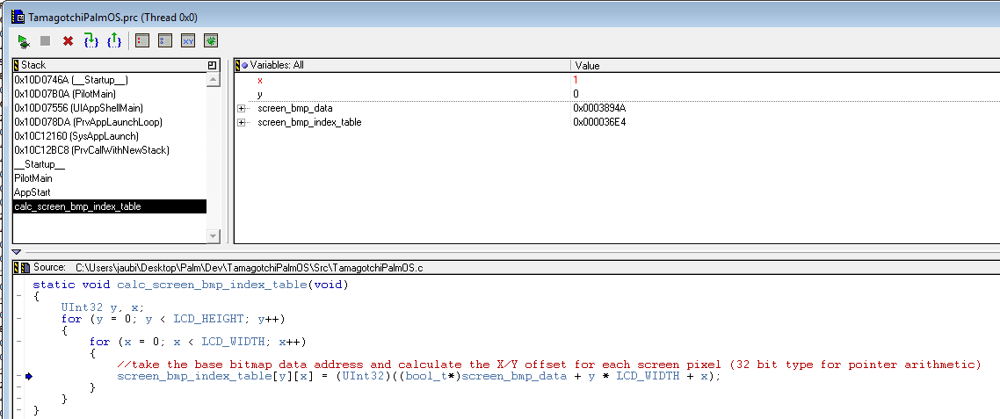
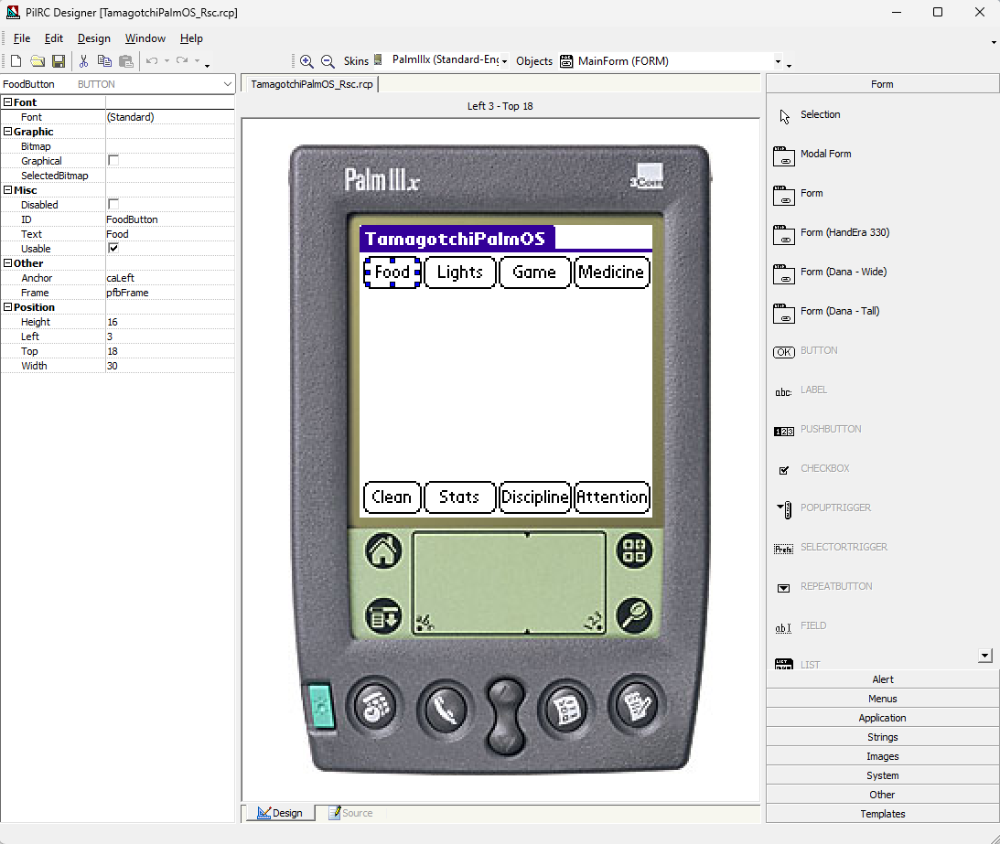
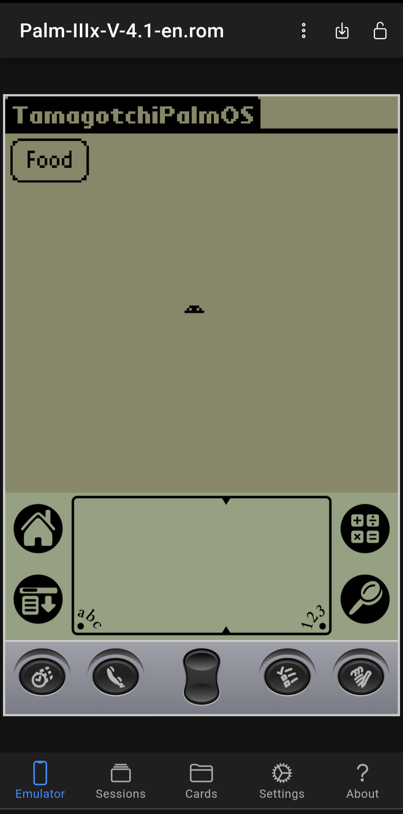
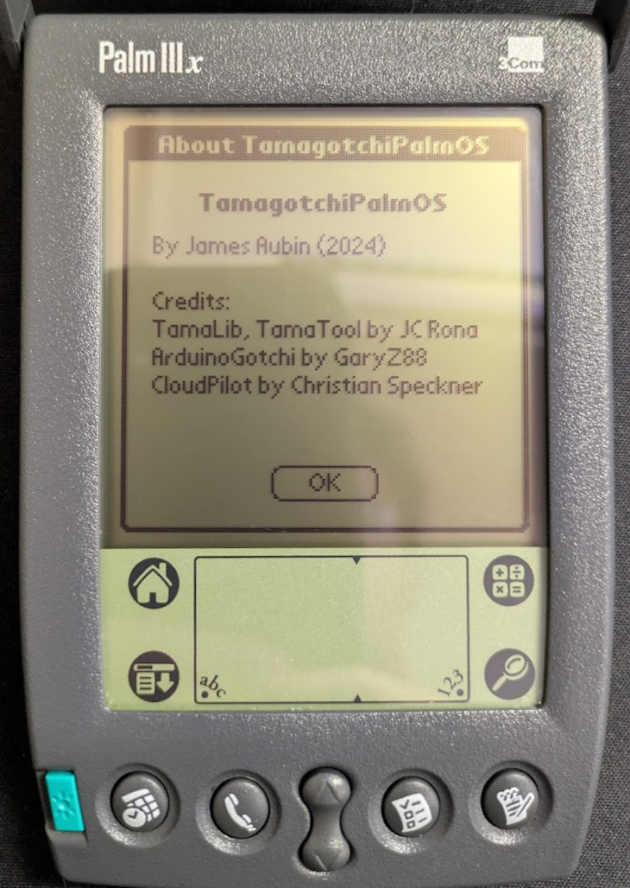

## Background

### The Palm IIIx

Back in August of last year, I started reading a lot about the original Palm OS handhelds which were built around the Motorola 68000-based Dragonball CPUs. 
I've always had an interest in retrocomputing and I was looking for a new programming project, so I looked around on eBay and picked up a Palm IIIx for an astounding $22.41. 

There's a lot of "DNA" in this device that was pretty forward-thinking and found its way in some way/shape/form into modern smartphones - most of the basic apps you would expect
to have by default today (calculator, calendar/organizer, notes, etc.) are all present here! There's even support for internet-dependent apps, like an email client, although 
they require you to either synchronize the device to your PC via a cradle (more on that later), or use some kind of external modem. The entire UI is stylus-based and the screen includes
a dedicated handwriting recognition area at the bottom for Palm's own "Graffiti" handwriting recognition system. It's a bit slow and crude by modern standards (shocker), but I found it 
to work pretty well when using the intended strokes and input instructions from Palm. The OS includes a soft-keyboard meant to be used with the stylus, but I found this to be pretty slow
for obvious reasons (try using your PC keyboard with one index finger). 

For a brief time, I tried to use the IIIx as a dedicated organizer and note-taking device. For high-volume typing, neither of the two included input methods would work. That pushed me 
towards my next purchase, a Palm folding keyboard. Like the IIIx, the keyboard is an impressive piece of tech, especially for the time. The keyboard folds and unfolds like an accordion
and has a dock at the top which the Palm plugs into and sits at an angle for tabletop use. The keyboard was even cheaper than the Palm itself, which was a welcome surprise given the 
high prices of most retro tech. 

<figure>
  
  <figcaption>Truly the pinnacle of portable computing in 1998.</figcaption>
</figure>

I set up the IIIx with its original cradle and a serial-to-USB adapter, and to my surprise, both it and the Palm HotSync software worked out of the box in Windows 11! I was able to use 
the cradle to flash the latest iteration of Palm OS for the IIIx and it proved to be a pretty good distraction-free journaling device/organizer. 

<figure>
  <video muted controls>
    <source src="videos/palm-flashing.mp4" type="video/mp4">
  </video> 
  <figcaption>Flashing the Palm IIIx with the latest Palm OS using the original cradle under Windows 11!</figcaption>
</figure>

Now that I had the Palm set up, I needed something to do with it. I had been wanting to learn more about C, and lots of Palm apps were written in C, so I just needed to think of something 
to code! I recalled a project I found a while back which I thought would be a good candidate:

### TamaLib

In the author Jean-Christophe Rona's words, "TamaLib is a hardware agnostic first-gen Tamagotchi (E0C6S46/8 based) emulation library built from scratch. It is self-contained and aims at running on any platform powerful enough,
from microcontrollers (MCUs) to desktop computers, thus spreading virtual life across the digital world.". The premise caught my eye, and after reading into it more, I found that this checked all of 
my personal boxes for a Palm OS project:
- Written in C 
- Portable (no external libraries or dependencies)
- Pertains to something I'm interested in (I had a *lot* of Tamagotchis as a kid)

The structure of TamaLib is really interesting. It's a Tamagotchi CPU emulator combined with a "Hardware Abstraction Layer" (HAL) - an interface which has to be implemented for the target platform that TamaLib is to be ported to
(in my case, the Palm IIIx). the HAL handles things like user input, sound playback, and updating the display. In this way, all of the core emulation code is portable and hardware-agnostic, which makes it pretty straightforward
to port to many platforms. 

I highly recommend reading the author's write-up on their [GitHub repo](https://github.com/jcrona/tamalib), it goes into some interesting technical details, such as how the 1st-gen Tamagotchi ROM was extracted - an original Tamagotchi 
CPU die was de-lidded and the ROM mask was optically read bit-by-bit using a microscope!

Now that I had a project in mind, I needed to set up a Palm OS development environment.

## The Project

### Development Environment

I looked around a bit for different compilers/IDEs tailored to writing software for the Dragonball CPU-based Palm devices and eventually settled on the Metrowerks CodeWarrior IDE, which I found an installer and supporting documentation for. 
CodeWarrior is an IDE which supports Motorola 68000-based devices like the original Macintosh (and my Palm IIIx). My install is dated 2003 and surprisingly, it runs fine under Windows 11. 

<figure>
  
  <figcaption>Bleeding-edge software.</figcaption>
</figure>

Unsurprisingly, the CodeWarrior IDE is a bit awkward & basic by modern standards. All of the files open in separate, nested windows that get pretty hard to manage and the syntax highlighting and theming options are pretty much nonexistent. 
What you see is truly what you get - no more, no less.

<figure>
  
  <figcaption>The IDE.</figcaption>
</figure>

Most importantly though, it worked, and it worked well. The IDE included a Palm emulator that you could push your code to and then run and inspect via the debugger. This was a huge help and saved me from pushing code manually to the actual 
Palm device, especially when I was debugging weird memory issues which would need a hard reset of the device to resolve. 

<figure>
  
  <figcaption>An active debug session connected to the included Palm emulator.</figcaption>
</figure>

The IDE build produced a .pdb file which could be sent over to the Palm via HotSync. It also included a lot of interesting tools and settings; you could optimize the resulting PDBs for speed or space, view the resulting assembly of your code, and lots more.
I'm sure someone more well-versed in these things could get a lot of use out of them. The most useful tool for my sake, though, was the PilRC designer, an app which let you define the user interface for a Palm OS app by dragging and dropping 
different widgets into their positions. The Palm OS devices were 160x160 resolution and there weren't any dynamic layout containers - everything was specified in absolute pixel values, perfect for a backend ape like me!

<figure>
  
  <figcaption>The PilRC Designer workflow. It was pretty intuitive to learn, thankfully.</figcaption>
</figure>

With everything in my environment set up, I could move on to porting TamaLib to Palm OS.

### Porting TamaLib

My CodeWarrior build used a proprietary C complier which was pretty out of date. That meant that a lot of the TamaLib code had to go or be converted to something more legacy-friendly. For example, the compiler didn't recognize enum typedefs, so I had to replace
all of the included TamaLib ones with ints and define statements. All variables had to be forward-declared, so things like for-loops had to have their loop counter declarations moved outside the loop. 

With those issues fixed, I was able to compile TamaLib! The next step was getting it to actually do anything, and for that, I'd need to load the ROM into memory and have the emulated CPU start to execute it. 
On that front, my first hunch was to get the Palm OS app to simply read the file from somewhere on the Palm's internal storage, but truthfully, I couldn't figure out how to get the file onto the device in the first place. I found some documentation on the Palm OS file
system, but I couldn't make much sense out of it. My next approach, while less elegant, ended up working. I took inspiration from [GaryZ88's Arduino port of TamaLib](https://github.com/GaryZ88/ArduinoGotchi/) and adapted it to my use-case. In their port, they simply 
defined a byte array containing the entire ROM within a C header. They included a Java-based helper script to convert an original Tamagotchi ROM into a byte-array, but I ended up using an online tool to convert binary files into byte arrays. Now that I had the ROM 
in a readable format, I could feed it to the CPU and start debugging. 

The biggest hurdle I ran into while porting TamaLib was definitely performance, especially on the actual Palm hardware. I used a system API call to blit pixels to the screen which seemed to be the biggest performance bottleneck, although I tried to strip out any of the TamaLib code
I didn't need in order to trim down the number of operations per emulator CPU tick as much as possible:
- Sound? Don't need it.
- Logging? Don't need it.
- Debugger? Don't need it. 
- Timing checks/virtual CPU sleep? Don't need it - no reason to sleep if the virtual CPU is already running too slowly!

In spite of removing all of the above features, the virtual CPU was still too slow, likely due to the draw calls taking up a bunch of time per frame. Oh well, I suppose running slowly is better than not running at all. 

One of the more deranged attempts I took at trying to optimize the emulator's performance was pre-sorting the definitions in the hard-coded opcode table from most-called to least-called by the virtual CPU. First, I needed
to determine the frequency of each instruction call throughout a typical emulator session. I did this by running the [gprof profiler tool](https://blog.mattjustice.com/2020/11/24/gprof-profiler/) on [JCRona's own TamaLib PC port, tamatool](https://github.com/jcrona/tamatool) in an Ubuntu VM
and converting the output (which lists function calls from most-frequently-called to least-frequently-called) into a more parseable format:


	{"PSET #0x%02X            "  , 0xE40, MASK_7B , 0, 0    , 5 , &op_pset_cb}, // PSET
	{"JP   #0x%02X            "  , 0x000, MASK_4B , 0, 0    , 5 , &op_jp_cb}, // JP
	{"JP   C #0x%02X          "  , 0x200, MASK_4B , 0, 0    , 5 , &op_jp_c_cb}, // JP_C
	{"JP   NC #0x%02X         "  , 0x300, MASK_4B , 0, 0    , 5 , &op_jp_nc_cb}, // JP_NC
	{"JP   Z #0x%02X          "  , 0x600, MASK_4B , 0, 0    , 5 , &op_jp_z_cb}, // JP_Z
	{"JP   NZ #0x%02X         "  , 0x700, MASK_4B , 0, 0    , 5 , &op_jp_nz_cb}, // JP_NZ
	{"JPBA                  "    , 0xFE8, MASK_12B, 0, 0    , 5 , &op_jpba_cb}, // JPBA
	{"CALL #0x%02X            "  , 0x400, MASK_4B , 0, 0    , 7 , &op_call_cb}, // CALL
	{"CALZ #0x%02X            "  , 0x500, MASK_4B , 0, 0    , 7 , &op_calz_cb}, // CALZ
	{"RET                   "    , 0xFDF, MASK_12B, 0, 0    , 7 , &op_ret_cb}, // RET



Next, I wrote a C# script to parse this input and print out an opcode table in C format with each opcode sorted by call frequency: 



/* This script takes the tamalib opcode table (input.txt) and reorganizes it by most-frequently-called function
 * to least-frequently-called function. The list of functions in call-frequency order (profiler-output.txt) was
 * created by taking the output from a gprof session with tamatool and removing all irrelevant information.
 * 
 * The resulting output (output.txt) contains the original opcode table sorted according to the profiler output.
 * Any functions which were not included in the profiler output were appended to the end of the opcode table.
 */

string OUTPUT_TEMPLATE = $"static const op_t ops[] = {{\r\n\r\n\t{0}\r\n\t{{NULL, 0, 0, 0, 0, 0, NULL}},\r\n}};\r\n";

//read files
List<string> inputLines = File.ReadAllLines("input.txt").ToList();
string[] orderedFuncs = File.ReadAllLines("profiler-output.txt");
List<string> outputLines = new List<string>();

//sort output by function call frequency
foreach (string currFuncName in orderedFuncs)
{
    string targetLine = inputLines.First(l => l.Contains(currFuncName));
    outputLines.Add(targetLine);
}

//add lines which were missing from profiler info to output
List<string> unprofiledLines = inputLines.Where(l => !outputLines.Contains(l)).ToList();

outputLines.AddRange(unprofiledLines);

//check for missing output
foreach (string outputLine in outputLines)
{
    if (!inputLines.Contains(outputLine))
    {
        throw new Exception($"Line '{outputLine}' missing from output");
    }
}

//construct C array def with output lines
string outputArrayText = "static const op_t ops[] = {" + System.Environment.NewLine + 
    string.Join(System.Environment.NewLine, outputLines) + System.Environment.NewLine + 
    "\t{NULL, 0, 0, 0, 0, 0, NULL}," + System.Environment.NewLine + 
    "};";

File.WriteAllText("output.txt", outputArrayText);



My intention with the above script was to try and save time by minimizing the amount of searching that the CPU tick loop does when it looks up the opcode for the current instruction - the code simply iterates over the opcode
array until it finds a match. In practice, this doesn't really save much time, if any (the opcode search is still linear time complexity, I just tried to improve the best-case scenario by moving the most frequently-called instructions
towards the front of the opcode array). I suppose it still makes for an interesting talking point?

Once I got the core functionality working, I could focus on a few quality-of-life enhancements to the Palm app. I wanted to use the buttons along the bottom of the Palm to control the Tamagotchi, and that proved to be a bit more
involved than expected. I found a code snippet from an old official Palm game, SubHunt, which did what I wanted to do: 


// Intercept the hard keys to prevent them from switching apps
// DOLATER CSS - Don't you want to prevent the app switch for vchrHardCradle
// too?  If so, the vchrHard1 & vchrHard4 tests should be removed.
if	(	(event.eType == keyDownEvent)
	&&	(TxtCharIsHardKey(event.data.keyDown.modifiers, event.data.keyDown.chr))
	&&	(event.data.keyDown.chr >= vchrHard1)
	&&	(event.data.keyDown.chr <= vchrHard4)
	&&	(GameStatus.status != checkHighScores)
	&& (!(event.data.keyDown.modifiers & poweredOnKeyMask)))
	{
	continue;
	}



The above code intercepts relevant button presses to prevent them from getting passed into the system event loop and handled outside of our application. I added it to my event loop and tailored it to the buttons I wanted to use, and it worked as intended.

The next feature I wanted to add was the top & bottom icon rows from the original Tamagotchi. I ended up using simple buttons for this, which was a bit crude but got the point across. PilRC made this pretty straightforward, and I was able to hook the HAL
into the buttons to get them to highlight with the corresponding Tamagotchi icon. 

Finally, I wanted a way to save the Tamagotchi CPU state to RAM when the app was suspended or the Palm was powered off. I ended up using the Palm OS "preferences" struct, which is meant for persisting app configuration across sessions. 
I simply wrote all of the CPU's registers and the RAM in this preferences struct when the app was suspended, and reloaded from it on app start if it was present.



static void load_state_from_prefs(void)
{
	int i;
	state_t* load_state;
	
	tamalib_set_exec_mode(EXEC_MODE_PAUSE);
	
	//fetch current state from emulator
	load_state = tamalib_get_state();
	
	//load state primitives from preferences struct
	*(load_state->pc) = g_prefs.pc;
	*(load_state->x) = g_prefs.x;
	*(load_state->y) = g_prefs.y;
	*(load_state->a) = g_prefs.a;
	*(load_state->b) = g_prefs.b;
	*(load_state->np) = g_prefs.np;
	*(load_state->sp) = g_prefs.sp;
	*(load_state->flags) = g_prefs.flags;
	*(load_state->tick_counter) = g_prefs.tick_counter;
	*(load_state->clk_timer_timestamp) = g_prefs.clk_timer_timestamp;
	*(load_state->prog_timer_timestamp) = g_prefs.prog_timer_timestamp;
	*(load_state->prog_timer_enabled) = g_prefs.prog_timer_enabled;
	*(load_state->prog_timer_data) = g_prefs.prog_timer_data;
	*(load_state->prog_timer_rld) = g_prefs.prog_timer_rld;
	*(load_state->call_depth) = g_prefs.call_depth;
	
	//load interrupts from preference struct
	for (i = 0; i < INT_SLOT_NUM; i++)
	{
		load_state->interrupts[i].factor_flag_reg = g_prefs.interrupts[i].factor_flag_reg & 0xF;
		load_state->interrupts[i].mask_reg = g_prefs.interrupts[i].mask_reg & 0xF;
		load_state->interrupts[i].triggered = g_prefs.interrupts[i].triggered & 0x1;
	}

	//load memory from preference struct
	for (i = 0; i < MEM_BUFFER_SIZE; i++)
	{
		load_state->memory[i] = g_prefs.memory[i] & 0xF;
	}
	
	//read memory and unpause
	tamalib_refresh_hw();
	tamalib_set_exec_mode(EXEC_MODE_RUN);
}

static void save_state_to_prefs(void)
{
	UInt32 i;
	state_t* save_state;
	
	tamalib_set_exec_mode(EXEC_MODE_PAUSE);
	
	//fetch current state from emulator
	save_state = tamalib_get_state();
	
	//save state primitives to prefs struct
	g_prefs.pc = *(save_state->pc);
	g_prefs.x = *(save_state->x);
	g_prefs.y = *(save_state->y);
	g_prefs.a = *(save_state->a);
	g_prefs.b = *(save_state->b);
	g_prefs.np = *(save_state->np);
	g_prefs.sp = *(save_state->sp);
	g_prefs.flags = *(save_state->flags);
	g_prefs.tick_counter = *(save_state->tick_counter);
	g_prefs.clk_timer_timestamp = *(save_state->clk_timer_timestamp);
	g_prefs.prog_timer_timestamp = *(save_state->prog_timer_timestamp);
	g_prefs.prog_timer_enabled = *(save_state->prog_timer_enabled);
	g_prefs.prog_timer_data = *(save_state->prog_timer_data);
	g_prefs.prog_timer_rld = *(save_state->prog_timer_rld);
	g_prefs.call_depth = *(save_state->call_depth);
	
	//save interrupts to prefs struct
	for (i = 0; i < INT_SLOT_NUM; i++)
	{
		g_prefs.interrupts[i].factor_flag_reg = save_state->interrupts[i].factor_flag_reg & 0xF;
		g_prefs.interrupts[i].mask_reg  = save_state->interrupts[i].mask_reg & 0xF;
		g_prefs.interrupts[i].triggered = save_state->interrupts[i].triggered & 0x1;
	}
	
	//save memory to prefs struct
	
	for (i = 0; i < MEM_BUFFER_SIZE; i++)
	{
		g_prefs.memory[i] = save_state->memory[i] & 0xF;
	}
}



### Testing Across Different Platforms

While testing the app, I found it beneficial to run it across several platforms, both real and emulated:
- The CodeWarrior Palm OS emulator (for stepping in the debugger)
- The CloudPilot emulator (very convenient since it was well-featured and I could run it on my PC and phone)
- My Palm IIIx (for testing performance on real hardware)

Credit where credit is due, the [CloudPilot emulator](https://cloudpilot-emu.github.io/) is incredible. It has a lot of features that made debugging this project a lot easier:
- Easy to use out of the box, just upload a ROM
- Supports multiple sessions 
- Cross-platform/portable (I used it on my phone and in a web browser on my PC)
- Lets you adjust the CPU speed (this was nice to help benchmark against my actual Palm)

<figure>
  
  <figcaption>Running my Palm OS app on CloudPilot via my smartphone.</figcaption>
</figure>

### Conclusion

Wow, that was a lot of words. I think it goes without saying, but I learned a lot throughout this project and found it really fulfilling. If you made it this far, I'd like to say thanks for taking the time to read all of this!

### Credits & References

- [TamaLib by JCRona](https://github.com/jcrona/tamalib)
- [TamaTool by JCRona](https://github.com/jcrona/tamatool)
- [ArduinoGotchi by GaryZ88](https://github.com/GaryZ88/ArduinoGotchi/)
- [CloudPilot Emulator by Christian Speckner](https://github.com/cloudpilot-emu/cloudpilot-emu)
- [*Profiling C code on Linux with gprof* by Matthew Justice](https://blog.mattjustice.com/2020/11/24/gprof-profiler/)

<figure>
  
  <figcaption>Many thanks to all of the above!</figcaption>
</figure>